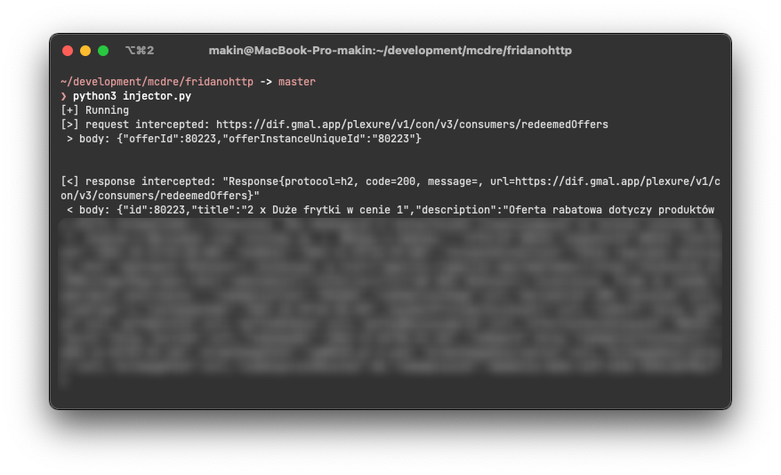

### Intercept OkHttp requests and responses using Frida.
An example project of intercepting [OkHttp](https://github.com/square/okhttp) requests and responses in obfuscated android app using [Frida](https://github.com/frida).

